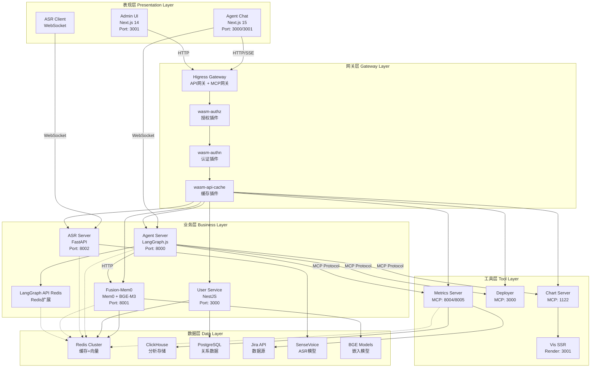
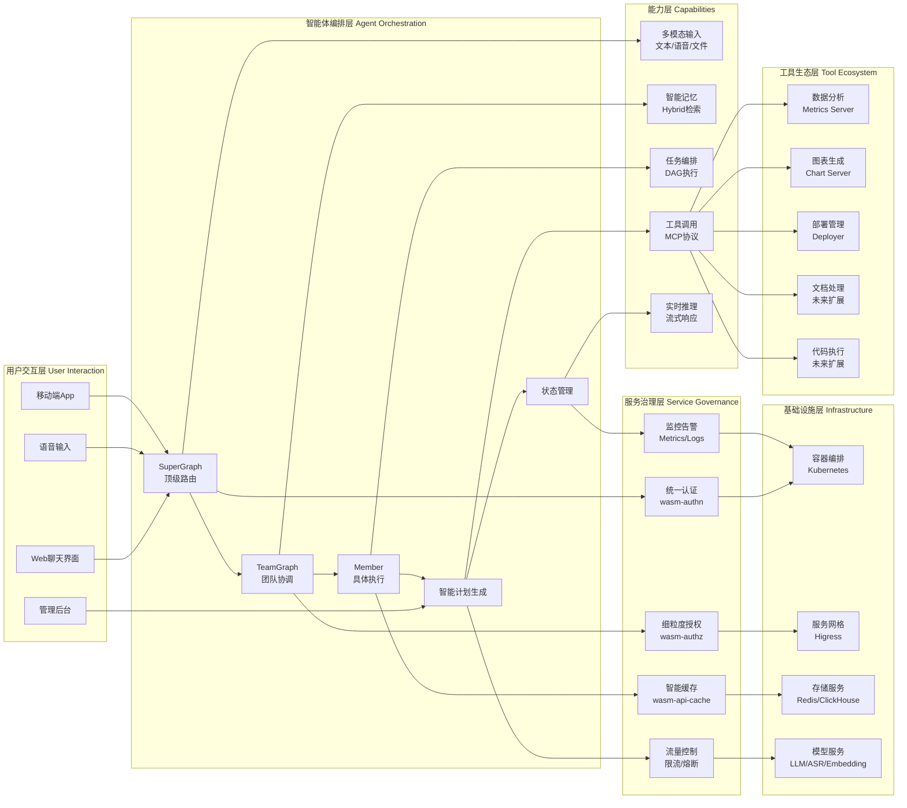
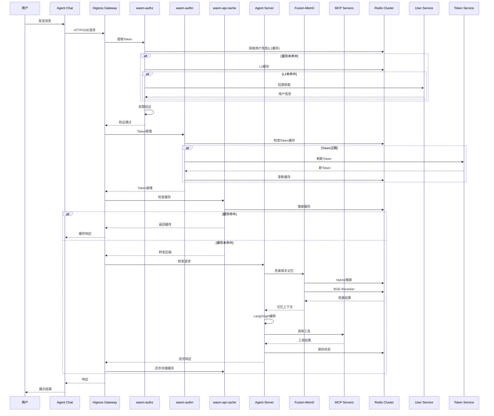
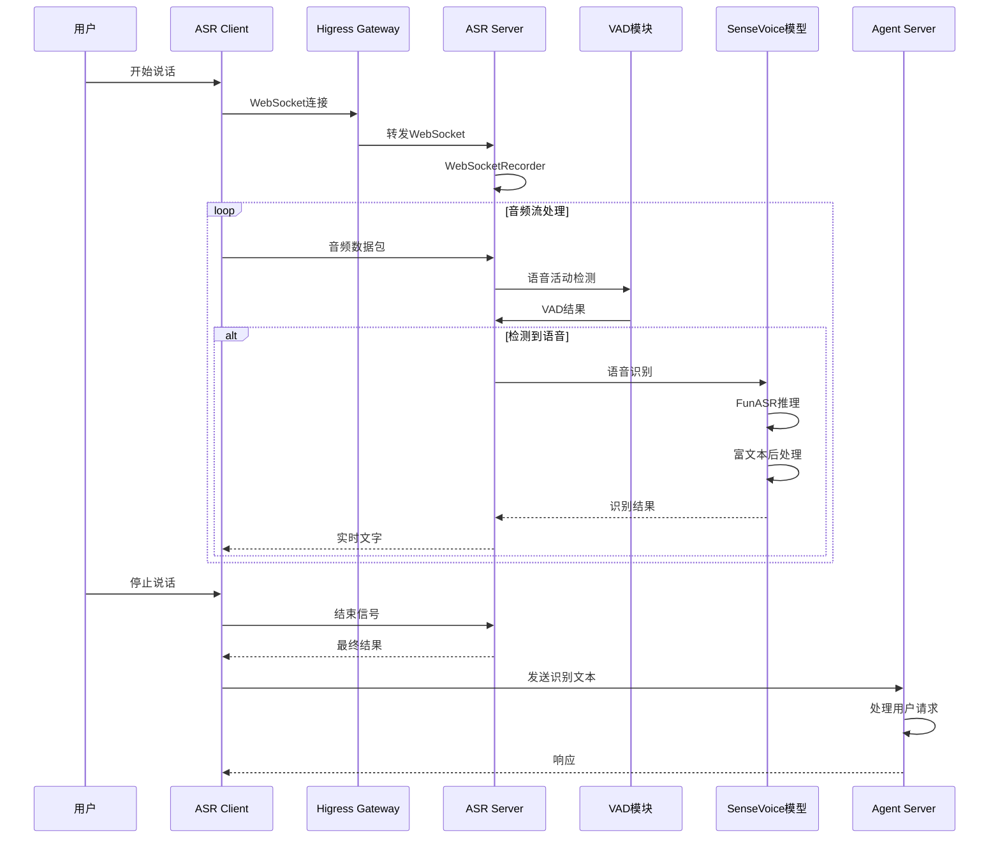
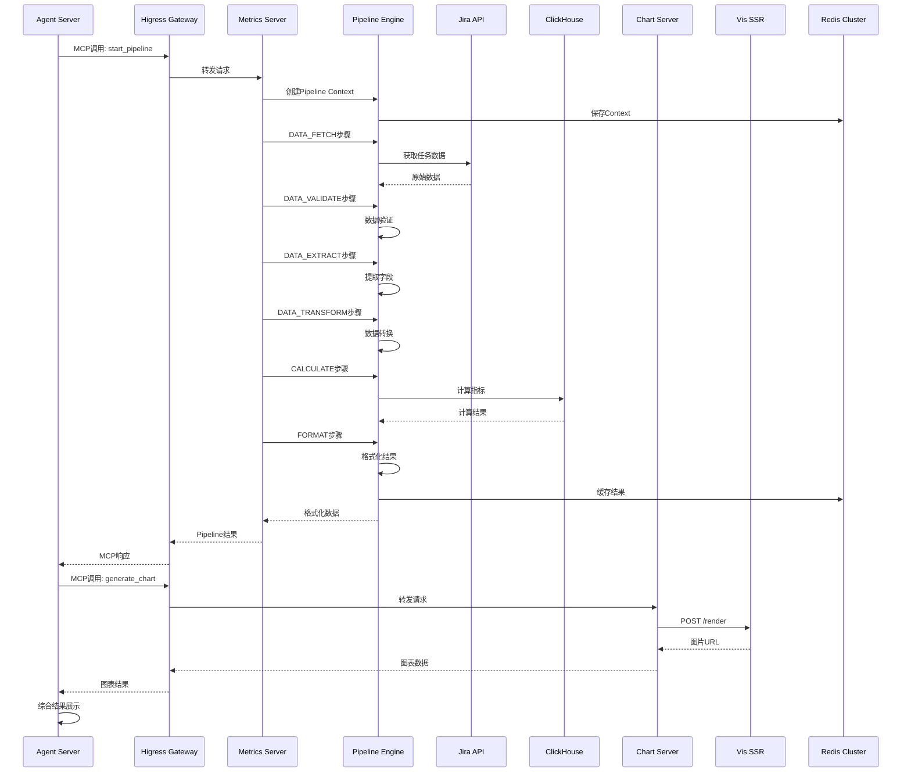

# 企业级AI Agent系统架构

## 一、项目概述

这是一个**企业级AI智能体编排平台**，采用微服务架构，实现了从用户交互、智能体编排、工具调用到服务治理的完整解决方案。系统基于**LangGraph多智能体框架**，通过**MCP协议**扩展工具能力，使用**Higress网关**进行统一治理，并集成**WASM插件**实现高性能的缓存、认证和授权。

### 核心特性
- **多智能体编排**：基于LangGraph的三层图架构
- **工具生态**：通过MCP协议提供丰富的"手脚"能力
- **统一网关**：Higress + WASM插件实现服务治理
- **智能记忆**：Hybrid检索 + BGE-Reranker重排序
- **语音识别**：50+语言实时识别，低延迟
- **用户管理**：RBAC权限控制，多提供商认证

---

## 二、模块划分

### 2.1 核心架构层级

```
┌─────────────────────────────────────────────────────────────┐
│                       表现层                                │
│  ┌──────────────┐  ┌──────────────┐  ┌──────────────┐    │
│  │ Agent Chat   │  │ ASR Client   │  │ Admin UI     │    │
│  │ (Web界面)    │  │ (语音输入)   │  │ (用户管理)   │    │
│  └──────────────┘  └──────────────┘  └──────────────┘    │
└─────────────────────────────────────────────────────────────┘
                           ↓
┌─────────────────────────────────────────────────────────────┐
│                       网关层                                │
│                    Higress Gateway                          │
│  ┌──────────────┐  ┌──────────────┐  ┌──────────────┐    │
│  │ wasm-authz   │  │ wasm-authn   │  │wasm-api-cache│    │
│  │ (授权插件)   │  │ (认证插件)   │  │ (缓存插件)   │    │
│  └──────────────┘  └──────────────┘  └──────────────┘    │
└─────────────────────────────────────────────────────────────┘
                           ↓
┌─────────────────────────────────────────────────────────────┐
│                       业务层                                │
│  ┌──────────────────────────────────────────────────────┐  │
│  │              Agent Core Services                     │  │
│  │  ┌────────────┐  ┌────────────┐  ┌────────────┐    │  │
│  │  │Agent Server│  │ASR Server  │  │Fusion-Mem0 │    │  │
│  │  │(LangGraph) │  │(语音识别)   │  │(记忆管理)   │    │  │
│  │  └────────────┘  └────────────┘  └────────────┘    │  │
│  │  ┌────────────┐  ┌────────────┐                     │  │
│  │  │User Service│  │LangGraph   │                     │  │
│  │  │(用户认证)   │  │API Redis   │                     │  │
│  │  └────────────┘  └────────────┘                     │  │
│  └──────────────────────────────────────────────────────┘  │
└─────────────────────────────────────────────────────────────┘
                           ↓
┌─────────────────────────────────────────────────────────────┐
│                       工具层                                │
│  ┌──────────────────────────────────────────────────────┐  │
│  │              MCP Tool Servers                        │  │
│  │  ┌────────────┐  ┌────────────┐  ┌────────────┐    │  │
│  │  │Chart Server│  │Deployer    │  │Metrics     │    │  │
│  │  │(图表生成)   │  │(部署管理)   │  │(指标计算)   │    │  │
│  │  └────────────┘  └────────────┘  └────────────┘    │  │
│  │  ┌────────────┐                                         │  │
│  │  │Vis SSR     │                                         │  │
│  │  │(可视化渲染) │                                         │  │
│  │  └────────────┘                                         │  │
│  └──────────────────────────────────────────────────────┘  │
└─────────────────────────────────────────────────────────────┘
                           ↓
┌─────────────────────────────────────────────────────────────┐
│                       数据层                                │
│  ┌────────────┐  ┌────────────┐  ┌────────────┐         │
│  │ Redis      │  │ ClickHouse │  │ Jira API   │         │
│  │ (缓存+向量)│  │ (分析存储) │  │ (数据源)    │         │
│  └────────────┘  └────────────┘  └────────────┘         │
│  ┌────────────┐  ┌────────────┐  ┌────────────┐         │
│  │ PostgreSQL │  │ SenseVoice │  │ BGE Models │         │
│  │ (关系数据) │  │ (ASR模型)   │  │ (嵌入模型) │         │
│  └────────────┘  └────────────┘  └────────────┘         │
└─────────────────────────────────────────────────────────────┘
```

### 2.2 详细模块清单

#### A. 表现层

| 模块名称 | 端口 | 技术栈 | 功能描述 |
|---------|------|--------|---------|
| **Agent Chat** | 3000/3001 | Next.js 15 + React 19 | Web聊天界面，实时思考流推送 |
| **ASR Client** | - | WebSocket Client | 语音输入客户端 |
| **Admin UI** | 3001 | Next.js 14 + Radix UI | 用户管理后台 |

#### B. 网关层

| 模块名称 | 类型 | 功能描述 |
|---------|------|---------|
| **wasm-authz** | WASM插件 | 三层权限验证（公开/认证/权限），L1+L2缓存 |
| **wasm-authn** | WASM插件 | 自动Token管理，定时刷新，Header/Form注入 |
| **wasm-api-cache** | WASM插件 | API响应缓存，Bitmap优化，Redis Search |

#### C. 业务层

| 模块名称 | 端口 | 技术栈 | 功能描述 |
|---------|------|--------|---------|
| **Agent Server** | 8000 | LangGraph.js + TypeScript | 多智能体编排，三层图架构 |
| **ASR Server** | 8002 | FastAPI + FunASR | 50+语言语音识别 |
| **Fusion-Mem0** | 8001 | Mem0 + BGE-M3 | 两阶段检索记忆管理 |
| **User Service** | 3000 | NestJS + SQLite | RBAC权限控制，多提供商认证 |
| **LangGraph API Redis** | - | TypeScript扩展 | Redis分布式状态持久化 |

#### D. 工具层

| 模块名称 | 端口 | 技术栈 | 功能描述 |
|---------|------|--------|---------|
| **Chart Server** | 1122 | Node.js + AntV | 基于MCP的图表生成 |
| **Deployer** | 3000 | TypeScript + Docker | 自动化部署管理 |
| **Metrics Server** | 8004/8005 | FastAPI + LangGraph | 企业级指标计算流水线 |
| **Vis SSR** | 3001 | Node.js + AntV | 服务端图表渲染 |

#### E. 数据层

| 组件 | 类型 | 用途 |
|------|------|------|
| **Redis Cluster** | 缓存+向量存储 | 状态管理、缓存、向量检索 |
| **ClickHouse** | 分析数据库 | 高性能指标数据存储 |
| **PostgreSQL** | 关系数据库 | 可选的数据持久化 |
| **Jira API** | 外部数据源 | 任务和工作日志数据 |
| **SenseVoice** | ASR模型 | 多语言语音识别 |
| **BGE-M3** | 嵌入模型 | 多语言语义向量 |

---

## 三、系统架构图



---

## 四、功能产品架构图



---

## 五、工作流程架构图

### 5.1 用户对话流程



### 5.2 语音识别流程



### 5.3 工具调用流程（以数据分析为例）



---

## 六、技术亮点与创新点

### 6.1 架构创新

1. **三层图架构**
   - SuperGraph（顶级路由）→ TeamGraph（团队协调）→ Member（具体执行）
   - 支持数百个智能体的复杂任务编排
   - 动态团队发现和加载

2. **WASM插件治理**
   - 网关层统一处理认证、授权、缓存
   - 业务层无需关注治理逻辑
   - 配置化管理，无需重编译

3. **两阶段检索**
   - Stage 1: Hybrid混合检索（稀疏+密集向量）
   - Stage 2: BGE-Reranker重排序
   - 准确率提升30-50%

### 6.2 性能优化

1. **分层缓存架构**
   - L1: 内存缓存（sync.Map）
   - L2: Redis缓存（Hash存储）
   - L3: Redis Search索引

2. **Bitmap缓存空洞优化**
   - 减少无效查询60-80%
   - 字符串/日期/数值三种Bitmap类型

3. **异步处理机制**
   - 异步Token获取，避免阻塞
   - 异步缓存存储，不阻塞请求
   - 流式响应，实时推送

### 6.3 企业级特性

1. **分布式状态管理**
   - Redis Checkpoint扩展
   - 支持集群部署和高可用
   - 即时状态持久化

2. **RBAC权限控制**
   - 用户、角色、权限、部门四级管理
   - 动态API路由
   - 细粒度权限验证

3. **多提供商认证**
   - Local认证 + OAuth2集成
   - 自动Token管理
   - 定时刷新机制

---

## 七、部署架构

### 7.1 Kubernetes部署

```yaml
Namespaces:
  - agent: Agent核心服务
  - mcp: MCP工具服务
  - higress: 网关服务
  - storage: 存储服务

Services:
  - agent-server: LangGraph编排服务
  - agent-chat: Web聊天界面
  - asr-server: 语音识别服务
  - fusion-mem0: 记忆管理服务
  - user-service: 用户认证服务
  - mcp-chart: 图表生成服务
  - mcp-deployer: 部署管理服务
  - mcp-metrics: 指标计算服务
  - mcp-vis-ssr: 可视化渲染服务

Ingress:
  - Higress Gateway: 统一入口

Storage:
  - Redis Cluster: 缓存+向量存储
  - ClickHouse: 分析数据库
  - PVC: 模型存储、日志存储
```

### 7.2 通信协议汇总

| 服务对 | 协议 | 端口 | 用途 |
|--------|------|------|------|
| Client → Higress | HTTPS | 443 | 统一入口 |
| Agent Chat → Agent Server | HTTP/SSE | 8000 | API调用 |
| Agent Chat → Agent Server | WebSocket | 3001 | 思考流推送 |
| Client → ASR Server | WebSocket | 8002 | 语音流 |
| Agent Server → Fusion-Mem0 | HTTP | 8001 | 记忆检索 |
| Agent Server → MCP Servers | MCP Protocol | 8001-8003 | 工具调用 |
| Agent Server → Redis | TCP | 6379 | 状态存储 |
| WASM插件 → Redis | TCP | 6379 | 缓存存储 |

---

## 八、各模块详细分析

### 8.1 Agent Server - 核心多智能体编排系统

**主要功能**：
- 基于 LangGraph.js 的企业级多智能体编排平台
- 支持复杂任务编排、智能分析和计划执行
- 实现三层图架构：SuperGraph → TeamGraph → Member

**技术栈**：
- 核心框架：LangGraph.js 0.4.9, LangChain Core 0.3.59, LangChain OpenAI 0.5.11
- 存储与持久化：Redis 4.6.13, @langchain/langgraph-checkpoint-redis
- MCP集成：@modelcontextprotocol/sdk 1.25.2, @antv/mcp-server-chart 0.9.7

**核心架构**：
```
SuperGraph → TeamGraph → Member
    │           │           │
顶级路由    团队协调     具体执行
```

**关键文件**：
- `/agent/agent_server/src/cli/enhanced-prod-server.ts` - 生产服务器入口
- `/agent/agent_server/src/graphs/graphFactory.ts` - 图工厂
- `/agent/agent_server/config.yaml` - 主配置文件

### 8.2 Fusion-Mem0 - 智能记忆管理服务

**主要功能**：
- 基于Mem0 AI框架的混合检索记忆系统
- 支持Hybrid混合检索和BGE-Reranker重排序
- 高质量语义记忆存储和检索

**技术栈**：
- Python 3.12+, Mem0 AI 1.0.1+
- BGE-M3嵌入模型，BGE-Reranker-v2-M3
- Redis + RedisVL

**核心架构**：
```
User Query
    ↓
Stage 1: Hybrid Search (筛选候选)
    ↓ (Top-N Candidates)
Stage 2: BGE-Reranker (精排)
    ↓
Final Results (Most Relevant Top-K)
```

### 8.3 WASM插件 - 服务治理能力

#### wasm-authz (授权插件)
- 三层权限验证（公开/认证/权限）
- L1+L2双层缓存
- 双锁模式并发控制
- 动态路由匹配

#### wasm-authn (认证插件)
- 自动Token管理
- Token缓存和刷新
- Header/Form注入
- 服务发现支持

#### wasm-api-cache (缓存插件)
- 响应智能解析
- 分组存储（用户/日期）
- Bitmap缓存空洞优化
- Redis Search集成
- 异步存储机制

### 8.4 MCP服务器 - 工具生态

#### Chart Server (mcp-server-chart)
- 端口：1122
- 功能：基于MCP协议的图表生成
- 支持柱状图、折线图、饼图等

#### Deployer (mcp-server-deployer)
- 端口：3000
- 功能：自动化部署管理
- 支持Docker镜像构建、K8s部署
- GitLab webhook集成

#### Metrics Server (mcp-server-metrics)
- 端口：8004/8005
- 功能：企业级指标计算
- 支持流水线编排、多数据源
- 6步数据处理流程

#### Vis SSR (mcp-vis-ssr)
- 端口：3001
- 功能：服务端图表渲染
- 生成PNG图片

---

## 九、总结

本系统是一个**企业级AI智能体编排平台**，具有以下核心优势：

1. **完整的架构设计**：从表现层到数据层的完整分层架构
2. **强大的编排能力**：基于LangGraph的多智能体编排系统
3. **丰富的工具生态**：通过MCP协议提供各种"手脚"能力
4. **统一的服务治理**：Higress + WASM插件实现网关层治理
5. **高性能的检索**：两阶段检索架构，准确率提升30-50%
6. **企业级特性**：分布式状态管理、RBAC权限控制、多提供商认证
7. **灵活的扩展性**：基于MCP协议，易于扩展新工具
8. **优秀的性能**：分层缓存、异步处理、Bitmap优化

该系统适用于需要构建复杂AI Agent应用的企业场景，如智能客服、数据分析、自动化运维等领域。

---

**项目总数**：13个核心服务（6个Agent服务 + 4个MCP服务 + 3个WASM插件）
